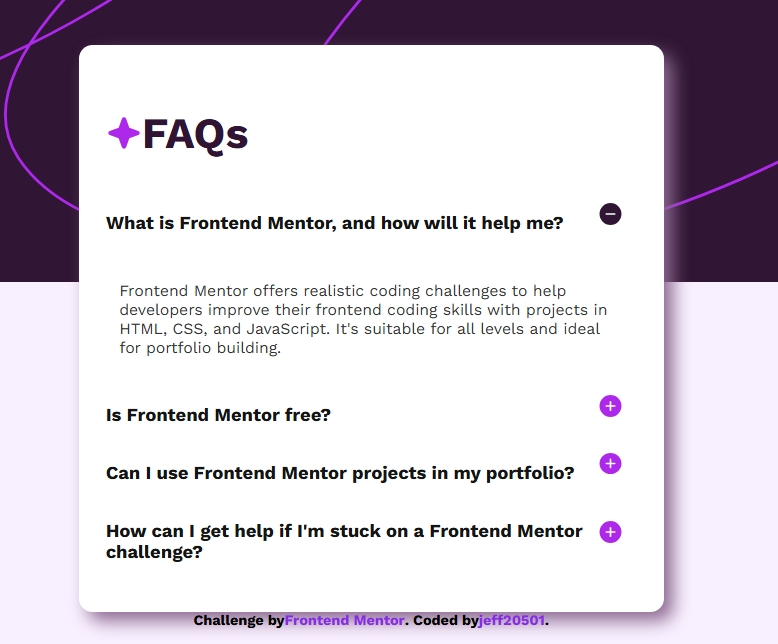

# Interactive-FAQ-Accordion


## Table of contents

- [Overview](#overview)
  - [The challenge](#the-challenge)
  - [Screenshot](#screenshot)
  - [Links](#links)
- [My process](#my-process)
  - [Built with](#built-with)
  - [What I learned](#what-i-learned)
  - [Continued development](#continued-development)
  - [Useful resources](#useful-resources)
- [Author](#author)
- [Acknowledgments](#acknowledgments)


## Overview
This project is an interactive FAQ Accordion built using semantic HTML, custom CSS, and vanilla JavaScript. The goal was to create a clean and user-friendly FAQ section where users can reveal and hide answers by clicking on a plus icon, which then toggles to a minus icon when the section is open.

## Screenshot


### The challenge

The main challenge was implementing the JavaScript logic to toggle each FAQ answer correctly. Initially, I was using querySelector, which only selects a single element, instead of querySelectorAll, which selects all matching elements and returns a NodeList.

Because of this, my first approach was only targeting one element at a time rather than all.

## How I fixed it:

Switched to using document.querySelectorAll() to grab all buttons, paragraphs, and icons as NodeLists.

Used forEach together with the index to match each button to its corresponding paragraph and icon.

Added a click event listener for each button that toggles the display and updates the icon source

## My process

### Built with

-Semantic HTML5 markup — Used for accessible and meaningful structure.
-Custom CSS — For styling, including colors, box shadows, border radius, and hover effects.
-Flexbox — Used to align content inside div containers and to control layout.
-Vanilla JavaScript (ES6) — For adding interactivity without using frameworks.
-Google Fonts — For custom fonts to improve typography.

## From CSS
How to use box-shadow to create depth and make elements stand out visually.

How to style buttons to have no default border and change color on hover for a more interactive feel.

Better understanding of background images and how to set them to cover, contain, and no-repeat.

### What I learned

## From JavaScript
How to use querySelectorAll() to select multiple elements and loop through them using forEach.

How to target corresponding elements using their index in the NodeList.

How to dynamically change an image’s src attribute to toggle icons.

The importance of conditionally checking style properties to hide/show elements.

## From CSS
How to use box-shadow to create depth and make elements stand out visually.

How to style buttons to have no default border and change color on hover for a more interactive feel.

Better understanding of background images and how to set them to cover, contain, and no-repeat.
To see how you can add code snippets, see below:

```html
<h1>Some HTML code I'm proud of</h1>
```
```css
.proud-of-this-css {
  color: papayawhip;
}
```
```js
const proudOfThisFunc = () => {
  console.log('🎉')
}
```


### Useful resources

- [Example resource 1](https://www.youtube.com/watch?v=MkvHPOT4RS8) - This helped me understand box-shadow. I really liked this pattern and will use it going forward.
- [Example resource 2](https://www.youtube.com/watch?v=MkvHPOT4RS8) - This is an amazing tutorial which helped me understand How to HIDE and SHOW HTML using JavaScript. I'd recommend it to anyone still learning this concept.


## Author

- Frontend Mentor - [jeff20501](https://www.frontendmentor.io/profile/jeff20501)
- Github - [jeff20501](https://github.com/jeff20501)


## Acknowledgments

Special thanks to Bro Code on YouTube for helping me understand the JavaScript toggle logic and for inspiration on CSS box shadow techniques.

## Summary
This FAQ accordion project helped me strengthen my skills in both JavaScript and CSS. I gained confidence working with dynamic DOM manipulation, event listeners, and advanced styling techniques to improve UI design.

It was a great exercise in thinking through interactions from a user's perspective, and learning to debug problems like element selection errors step by step.

